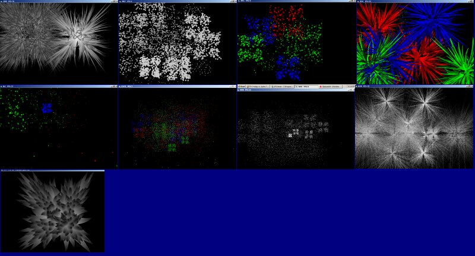



## Particle engine test: fireworks

### Description

This particle engine renders pixels or ellipses using API, very fast results and interesting combination of effects. Many variables for different effects combinations.
 
### More Info
 

             |
---                |---
**Submitted On**   |2002-12-23 00:07:16
**By**             |[Tecc](https://github.com/Planet-Source-Code/PSCIndex/blob/master/ByAuthor/tecc.md)
**Level**          |Intermediate
**User Rating**    |5.0 (20 globes from 4 users)
**Compatibility**  |VB 6\.0
**Category**       |[Graphics](https://github.com/Planet-Source-Code/PSCIndex/blob/master/ByCategory/graphics__1-46.md)
**World**          |[Visual Basic](https://github.com/Planet-Source-Code/PSCIndex/blob/master/ByWorld/visual-basic.md)
**Archive File**   |[Particle\_e15170912232002\.zip](https://github.com/Planet-Source-Code/tecc-particle-engine-test-fireworks__1-41787/archive/master.zip)

